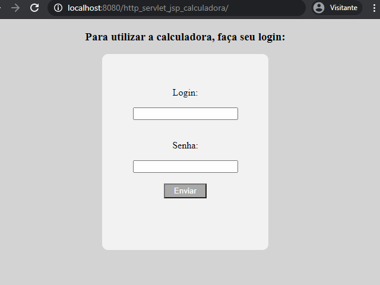

# Laboratório de Engenharia de Software 

<h1>Calculadora</h1> 
<h2>Proposta</h2>

Desenvolver uma calculadora que é somente acessível a usuários logado, as operações são efetuadas no back end que recebe, via requisição AJAX, os 2 operandos e a operação a ser efetuada, retornando o resultado. O usuário poderá acessar seu histórico de operções realizadas.
  
<h2> Tecnologias Utilizadas: </h2>
 
 

<h2>Demonstração do Protótipo Navegável: </h2>

 
